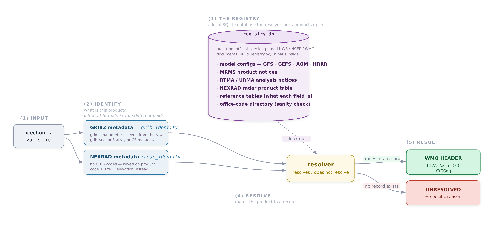
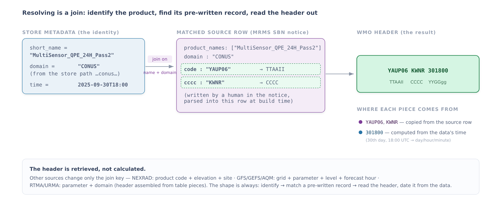
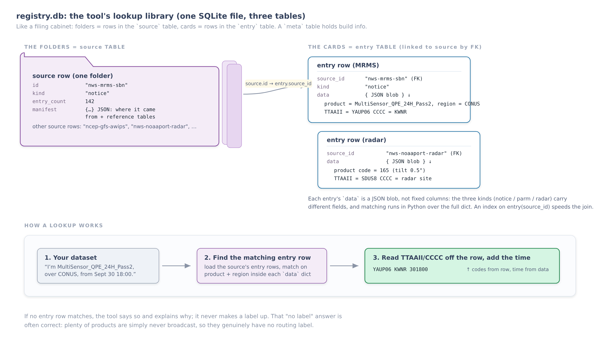

# cirrus_wmo — WMO abbreviated heading resolver

Repository: https://github.com/ShaneMill1/WMO_Header_Generator

## What this does, in one minute

Weather data (model forecasts, radar, etc.) gets shipped around the world over a
shared network. Every file that travels on that network wears a short label on
the front — the **WMO abbreviated heading** — so the routing computers know what
it is and where to send it. It looks like this:

```
YAUP06 KWNR 301800
```

That label isn't random, and it isn't something you can calculate from the data.
A person decided, once, "this product gets this label," and wrote it down in an
official document. This tool answers a simple question:

> I have a weather dataset sitting in storage. **What label would it travel
> under** — and if it doesn't get one, why not?

You point it at a dataset; it prints the label (or a plain reason there is none):

```
$ python read_icechunk.py
WMO: YAUP06 KWNR 301800
     product     : MultiSensor_QPE_24H_Pass2
     domain      : CONUS
     valid (UTC) : 2025-09-30T18:00
     authority   : nws-mrms-sbn -> MRMS-v12.2-supp
```

It handles the common U.S. weather products — model output (GFS, GEFS, AQM, HRRR,
MRMS, RTMA/URMA) and NEXRAD radar.

## Decoding the label

The heading is four chunks. You don't need to memorize this, but it helps to
know what the letters mean when you see them below:

```
YAUP06   KWNR   301800   (BBB)
  │       │       │        └─ optional: marks a correction/amendment
  │       │       └─ WHEN:  day 30, 18:00 UTC   (this is the only part from the data)
  │       └─ WHO:   the office that put it out   (KWNR = a national center)
  └─ WHAT: the product + region, as a code       (YAUP06 ≈ a specific MRMS product over CONUS)
```

Jargon you'll meet, defined once:

| Term | Plain meaning |
| --- | --- |
| **WMO heading** | the routing label above (`TTAAII CCCC YYGGgg`) |
| **TTAAII** | the "what + where" code (first chunk, e.g. `YAUP06`) |
| **CCCC** | the "who sent it" code (e.g. `KWNR`, `KWBC`) |
| **YYGGgg** | day/hour/minute, computed from the data's timestamp |
| **disseminated** | actually broadcast on the network (if it isn't, it has no label) |
| **GRIB2** | the standard file format for gridded model/analysis data |
| **NEXRAD** | the national weather-radar network |
| **icechunk / zarr** | the storage format the datasets live in |
| **registry** | this tool's local database of "which product → which label" |

## How it works



**Reading the diagram, left to right:** a dataset comes in (1); the tool reads
its metadata to figure out *what product it is* (2); it looks that product up in
a built-in library of official documents that record who assigned which label
(3); it tries to match (4); and it either prints the label or says, specifically,
why there is none (5). The one-line version:

1. **Input** — a dataset in storage (an icechunk / zarr "store").
2. **Identify** — read the dataset's metadata to work out what the product is.
   Model data and radar describe themselves differently, so each gets its own
   reader.
3. **The registry** — a local SQLite database (`registry.db`) built from
   official NWS / NCEP / WMO documents that say which product gets which label.
   Each document is pinned to an exact version and checksum, so the answers are
   traceable, not guessed. (What's inside it is covered under "Registry
   database" below.)
4. **Resolve** — match the product against those sources.
5. **Result** — either a label (it traced to a record) or an "unresolved" with a
   clear reason.

## How the mapping works

This is the part that trips people up, so here's the mental model: **it's a
lookup, not a calculation.** The tool never *builds* a label out of the data. It
figures out what the product is, finds the one row in an official table that
already lists that product, and copies the label off that row. The only piece it
computes is the timestamp (`YYGGgg`), straight from the data's own clock.

The catch is that different products are identified by different things — a radar
product by its site and tilt, a model field by its grid and variable — so there's
no single "key" that works for all of them. Each kind of source is matched on the
fields that source actually uses. The table below is the full breakdown; the one
rule that holds everywhere is: **`TTAAII` and `CCCC` come from the official
source, `YYGGgg` comes from the data** (radar is the lone twist — its `CCCC` is
the radar site, which is also read from the data).

| Source | Fields read from the store | Matched against | Produces the header by |
| --- | --- | --- | --- |
| **MRMS** (SBN notices) | product `short_name`; domain (from the store path, e.g. `…conus…`) | normalized product name + domain, in the notice entries | copying `code` → `TTAAII` and `cccc` → `CCCC` straight from the matched entry |
| **RTMA / URMA** (TINs) | parameter `short_name`; `dataset\|resolution\|domain` key (from the store path, e.g. `rtma\|2p5\|conus`) | parameter → `T2` lookup, and dataset key → `A1` lookup, in the TIN tables | **composing** `TTAAII = T1 + T2 + A1 + A2ii` (T1/A2ii/CCCC are fixed per table) |
| **GFS / GEFS / AQM** (tocgrib2 parm) | `grib_section3` (grid), `short_name` (→ parameter), PDT fields: level, forecast hour, generating process, statistical window | grid match + parameter + every PDT field the parm record pins (wildcards where the record leaves `-9999`) | copying `TTAAII` / `CCCC` from the matched parm record |
| **HRRR** (tocgrib2 parm) | same identity, but read from **CF metadata**: grid from the `spatial_ref` grid-mapping + `x`/`y`; level from the scaled-value coords; forecast hour from `lead_time`; reference time from `init_time` | parameter + level + forecast hour, scoped to HRRR's own records (`KWBY`) | copying `TTAAII` / `CCCC` from the matched HRRR parm record |
| **NEXRAD L3** (NOAAPort table) | `product_code`, `elevation_angle`, `site_id`, `scan_time` | `(product_code, elevation)` → one table row → mnemonic + `SDUS` tier | `TTAAII` = the row's `SDUS<tier>`; `CCCC` = `site_id` from the data |

Two details worth calling out:

- **The parameter is never stored, so it's inferred.** GRIB2 archives keep the
  product's `short_name` but not its discipline/category/number. Those are looked
  up from `short_name` against the grib2io parameter tables, then matched against
  the parm record. If a name maps to more than one parameter, that's reported as
  ambiguous rather than guessed (this is why some GFS/GEFS fields like `CFRZR`
  come back unresolved).
- **Exact vs parameter-level (GRIB2).** If the store's grid *is* a disseminated
  grid, the match is **exact** — the header is authoritative for that data. If the
  store is on a native, non-disseminated grid (e.g. GFS at 0.25°, HRRR at 3 km),
  the resolver reports the header NWS assigns to the *same field on its AWIPS
  grid*, flagged as **parameter-level** with a caveat, never as if it were the
  real bulletin.
- **Two GRIB2 metadata encodings.** The same GRIB2 identity can be stored two
  ways. Some archives keep the raw GRIB2 Section 3 array (`grib_section3`) and
  PDT prose; others (e.g. the CIRRUS HRRR stores) keep it as CF metadata — a
  `spatial_ref` grid-mapping, projected `x`/`y`, and scaled-value level
  coordinates. The resolver reads either; the join to the authoritative source is
  identical once the grid, parameter, level, and forecast hour are in hand.

### Worked example (MRMS)

Picture two tables side by side. On the left, the one dataset you're holding. On
the right, a long list of products someone already assigned labels to. You find
the row on the right that describes your dataset, and read the label off it.
That's the whole trick — the matching row *already contains* the answer.



**Reading the diagram:** your dataset's metadata (left) is matched to one row in
the MRMS source table (middle); the label fields on that row — highlighted in
green — are copied straight into the final heading (right). Only the timestamp is
filled in from the data. Here it is step by step, for the MRMS example at the
top of this README:

1. **Read the identity from the store.** The variable's metadata gives
   `short_name = "MultiSensor_QPE_24H_Pass2"` and `time = 2025-09-30T18:00`; the
   store path `…conus_lambert…` gives `domain = CONUS`.

2. **Find the matching source row.** At build time the MRMS SBN notice was parsed
   into rows and indexed by product name. The identity's name + domain select one
   row:

   ```
   product_names : ["MultiSensor_QPE_24H_Pass2", …]
   domain        : "CONUS"
   code          : "YAUP06"     ← TTAAII, written by a human in the notice
   cccc          : "KWNR"       ← originating office, from the notice
   ```

3. **Read the header off the row, stamp the time from the data.**
   `TTAAII = code = YAUP06`, `CCCC = cccc = KWNR` (both copied from the row), and
   `YYGGgg = 301800` (the day/hour/minute computed from `2025-09-30T18:00`).

   Result: **`YAUP06 KWNR 301800`.**

The header `YAUP06 KWNR` was never derived from the data — it was assigned once,
recorded in the notice, and we found it by matching the product's identity. The
other sources differ only in the join key (and, for RTMA/URMA, the header is
assembled from table pieces instead of copied whole), but the shape is the same:
**identify → match a pre-written record → read the header, date it from the data.**

## It is a resolver, not a generator

A heading cannot be computed from data. Its [form](https://www.weather.gov/tg/headef)
is fixed:

```
T1T2A1A2ii  CCCC  YYGGgg  (BBB)
```

but the specific `A2ii` and `CCCC` for a product are a **human allocation
decision**, made once when the product is added to dissemination and written
down in an operational config or a public notice. The `ii` is a two-digit number
assigned from the WMO/national-practice tables; it is a bookkeeping designator,
not something derivable from the data.

Even the operational tool (`tocgrib2`) doesn't compute headings; it looks them up
in pre-written records and copies the string out, stamping only the `YYGGgg`
day/hour from the data. This project runs that lookup **backwards**: given
archived metadata, find the allocation someone already made. Where no allocation
exists, there is no heading to find.

## Accurate or nothing

A heading is emitted only when every field traces to an authoritative record.
Otherwise you get an `Unresolved` that says what was missing. The resolver never
guesses: it won't default a domain or originating office, won't invent a
timestamp, and won't pick between candidates the evidence can't distinguish. A
"no header" answer is often the *correct* answer — see the Demo for which
products have a heading and which don't.

## Demo

All output below is real. Commands use the project's Python environment.

### MRMS (GRIB2) — resolves

```
$ python read_icechunk.py --limit 5
WMO: YAUP06 KWNR 301800
     product     : MultiSensor_QPE_24H_Pass2
     description : MultiSensor_QPE_[01,03,06,12,24,48,72]H_Pass2
     domain      : CONUS
     valid (UTC) : 2025-09-30T18:00
     authority   : nws-mrms-sbn -> MRMS-v12.2-supp
     source group: /1/precipitation_accumulation_24_hour
Resolved 1 heading(s); 0 product(s) unresolved.
```

Add `--explain` to see the matching evidence and the verbatim source text.

### RTMA / URMA (GRIB2 analysis) — resolves

Analysis-grid fields that the NWS TINs assign a header to resolve; fields the
TINs don't cover (cloud ceiling, specific humidity, …) correctly do not.

```
$ python read_icechunk.py --prefix "edr-api/rtma2p5_v2p10/2018-01/rtma2p5_v2p10-conus_lambert-2018-01.ic" --limit 5
WMO: LTIA98 KWBR 312300
     product     : TMP
     description : temperature analysis
     level       : 2.0 m
     valid (UTC) : 2018-01-31T23:00
     authority   : nws-rtma-urma -> TIN11-42 + TIN11-42
     source group: /1/temperature_height_above_ground
...
Resolved 5 heading(s); 3 product(s) unresolved.
Unresolved products: ['CEIL', 'SPFH', 'TCDC']
```

(URMA behaves the same, e.g. `LTQA98 KWBR` for temperature.)

### GFS at native 0.25° (GRIB2) — parameter-level, with a caveat

The archived GFS is on its native global grid, which is *not* a disseminated
grid. The resolver won't claim a header for this exact grid, but it can report
the header NWS assigns to the same field on its AWIPS grid — flagged as a
parameter-level match, not an exact one:

```
$ python read_icechunk.py --prefix "edr-api/gfs0p25_v16p3/2021-01-01T00:00/gfs0p25_v16p3-global_latlon-2021-01-01T00:00.ic" --limit 5
WMO: YHPY99 KWBC 110000
     product     : HGT
     description : HGT      1000 mb
     match       : parameter-level (see note)
     note        : NWS assigns this to the field on grid 'gfs_awips_1p0deg_003';
                   the archive is the native file grid (1440x721 gdt0), which is
                   not disseminated under a WMO header
     authority   : ncep-gfs-awips -> grib2_awpgfs240.003:1
```

### HRRR, CF-encoded (GRIB2) — parameter-level, with a caveat

A CIRRUS HRRR store carries its GRIB2 identity as CF metadata (no
`grib_section3`). The store type and model are detected automatically; the grid
is read from the CF `spatial_ref`, and the field resolves to HRRR's own `KWBY`
header. Being on the native 3 km grid (not the disseminated 2.5 km grid 184), it
is a parameter-level match:

```
$ python read_icechunk.py --local /efs/cirrus_test_data/HRRR-2026-09-21-sample-v2.icechunk --limit 1
Store type: CF-encoded GRIB2 (model source: ncep-hrrr-awips)
WMO: YHCA73 KWBY 160700
     product     : HGT
     description : HGT      Cloud base lvl
     match       : parameter-level (see note)
     note        : NWS assigns this to the field on grid 'hrrr_awips_184_2p5km_lambert';
                   the archive is the native file grid (1799x1059 gdt30), which is
                   not disseminated under a WMO header
     lead (h)    : 0.0
     authority   : ncep-hrrr-awips -> grib2_awips_hrrrf00.184:56
     source group: /cloud_ceiling/HGT
```

The forecast hour drives the `A2` character of the heading, so the same field
across lead times produces `YHCA…`, `YHCB…`, `YHCC…` (f00, f01, f02, …), each
tracing to the matching per-hour parm file.

### NEXRAD Level III, disseminated — resolves

A radar store is detected automatically; local stores use `--local`.

```
$ python read_icechunk.py --local /efs/cirrus_test_data/KTLX_165_0.5_icechunk
Store type: NEXRAD radar (CF/Radial)
WMO: SDUS8 KTLX 081617
     product     : Digital Hydrometeor Classification
     code         : 165
     description : Digital Hydrometeor Classification (N0H)
     elevation    : 0.5
     site (CCCC)  : KTLX
     authority    : nws-noaaport-radar -> noaaport-radar-products
     note         : CCCC KTLX not in XR-09 directory (radar site codes are not WFO nodes)
     source group : /KTLX/165_DHC
Resolved 1 heading(s); 0 product(s) unresolved.
```

Matched by `(product code 165, elevation 0.5°)` → mnemonic `N0H` → `SDUS8`;
site `KTLX` becomes the CCCC; the time comes from the scan time.

### NEXRAD Level III, not disseminated — unresolved

Product 167 (Super-Res Digital Correlation Coefficient) is a real product but is
not broadcast on the SBN, so it has no heading:

```
$ python read_icechunk.py --local /efs/cirrus_test_data/KTLX_167_0.5_icechunk
UNRESOLVED: HC  (group /KTLX/167_HC)
     product code 167 is not disseminated on the SBN under a WMO heading
     (absent from the NOAAPort radar table; e.g. super-res products 167/168
     are defined but not broadcast)
Resolved 0 heading(s); 1 product(s) unresolved.
```

### NEXRAD Level II — unresolved

Level II base data moves as whole-volume files (LDM/FTP), not as headered
bulletins, so each sweep resolves to a precise reason:

```
$ python read_icechunk.py --local /efs/cirrus_test_data/KDFX_icechunk
UNRESOLVED: radar  (group /sweep_0)
     Level II base data are distributed as whole-volume files via LDM/FTP,
     not under a WMO abbreviated heading; no authoritative record assigns one
...
Resolved 0 heading(s); 4 product(s) unresolved.
```

### What resolves, and why

| Product | Result | Why |
| --- | --- | --- |
| MRMS SBN product (e.g. 24-hour QPE) | ✅ exact — `YAUP06 KWNR 301800` | assigned a header in the MRMS SBN notices |
| RTMA / URMA analysis field in the TINs | ✅ exact — `LTIA98 KWBR 312300` | header pieces published in the NWS TINs |
| NEXRAD Level III SBN product (e.g. 165 DHC) | ✅ exact — `SDUS8 KTLX 081617` | listed in the NOAAPort radar table |
| GFS / GEFS at native 0.25° resolution | ⚠️ parameter-level — `YHPY99 KWBC 110000` | the native grid isn't disseminated, so the header for the same field on the AWIPS grid is reported with a caveat (only where that field is headered; otherwise unresolved) |
| HRRR at native 3 km (CF-encoded) | ⚠️ parameter-level — `YHCA73 KWBY 160700` | same as GFS: native grid isn't the disseminated 2.5 km grid, so HRRR's own `KWBY` header is reported with a caveat |
| RTMA / URMA field not in the TINs (CEIL, SPFH, TCDC) | ❌ | no NWS record assigns it a header |
| NEXRAD Level III, not on the SBN (e.g. 167, 168) | ❌ | real product, but never broadcast under a heading |
| NEXRAD Level II base data | ❌ | distributed as whole-volume files (LDM/FTP), never headered |

Three kinds of result: an **exact** header (authoritative for that data), a
**parameter-level** header (the field is headered on a different, disseminated
grid — reported with a caveat, never silently), or **unresolved** with a reason.
A ❌ is the correct answer, not a gap: those products genuinely have no WMO
heading to find.

## Usage

```bash
# Just run it. The registry builds itself on first use.
python read_icechunk.py                          # default MRMS store (S3)
python read_icechunk.py --prefix path/to/store.ic --explain
python read_icechunk.py --local /path/to/radar_store   # local radar store
python read_icechunk.py --local /path/to/hrrr.icechunk # CF-encoded GRIB2 (HRRR)
#   model source is inferred from the path; override with --source <id>

# Rebuild the registry explicitly (e.g. after editing sources.json).
python build_registry.py
python build_registry.py --source ncep-hrrr-awips

python -m pytest tests/ -q                       # hermetic tests, no network
```

The default MRMS store is on S3 and needs AWS credentials in the environment;
local stores (e.g. radar on `/efs`) use `--local` and need none.

## The sources

The registry is built from pinned, hash-verified public documents. Each answers
a different piece of the question:

| Source | What it provides |
| --- | --- |
| **tocgrib2 parm** (GFS · GEFS · AQM · HRRR) | NCEP's operational config that stamps the WMO header onto each model GRIB2 product (HRRR's are the `KWBY` parm files published per model version on the NCO server) |
| **MRMS SBN notices** | NWS bulletins assigning headers to MRMS products by name |
| **RTMA / URMA TINs** | NWS Technical Implementation Notices giving the header pieces for the analysis grids |
| **NOAAPort radar table** | NWS list of which NEXRAD Level III products are broadcast on the SBN and under which `SDUS` heading |
| **WMO / GRIB2 code tables + grib2io** | reference tables for what a field *is* (parameter, level, process) — not header assignment |
| **XR-09 office directory** | official list of valid NWS office identifiers (CCCC), used to sanity-check the originating office |

Two layers are kept deliberately separate: **identity** (what a field is) versus
**header assignment** (which header, if any, NWS gives it). grib2io answers the
first; only the parm files and notices answer the second. No GRIB library assigns
headers — that is a dissemination decision, not a property of the data.

## Project layout

| Path | Role |
| --- | --- |
| `read_icechunk.py` | CLI entry point; branches GRIB2-array vs CF-encoded GRIB2 vs radar |
| `grib_identity.py` / `radar_identity.py` | read a store's metadata into a product identity (`grib_identity` handles both the `grib_section3` and CF encodings) |
| `wmo_header.py` | match an identity to a header, or return `Unresolved` |
| `build_registry.py` | fetch, verify, and parse the pinned sources into the registry |
| `registry_db.py` | read/write the SQLite registry database |
| `tocgrib2_parm.py` · `nws_notice.py` · `nexrad_radar.py` | parsers for each source format |
| `registry/sources.json` | the pinned source manifest — the only hand-written data file |
| `tools/` | dev utilities: `inspect_icechunk.py`, `make_synthetic_l3.py` |
| `docs/` | architecture diagram and a step-by-step demo |
| `tests/` | hermetic tests (no network) |

The registry itself (`registry/registry.db`, a SQLite file) is build output and
is not committed; `read_icechunk.py` builds it on first run. `sources.json` is
the audit trail — it pins every upstream document by tag and sha256, and the
build refuses to proceed on a mismatch. Every source is a public NWS / NCEP / WMO
document, cited per entry in the database.

### Registry database

The "registry" is just one SQLite file, `registry/registry.db` — the local
library of official product-to-label mappings the tool looks things up in. You
build it once (or let the tool build it on first run) and then every lookup is
offline.



**Reading the diagram — picture a filing cabinet:**

- **Folders** — one per official document the labels came from (the MRMS notice,
  the GFS config, the radar table, …). A folder just records *where* a set of
  labels came from, plus any reference tables that document needs.
- **Cards** — inside each folder, one card per product-to-label assignment. A
  card holds what the document said: the product's description and its two label
  codes (the "what" `TTAAII` and the "who" `CCCC`). One folder holds many cards.
- **A lookup** (bottom strip) — the tool takes your dataset, finds the one card
  whose product matches, reads the two codes off it, and stamps on the time from
  the data. If no card matches, it says so and explains why — it never invents a
  label.

Under the hood those "folders" and "cards" are two SQLite tables (`source` and
`entry`, plus a tiny `meta` table of build info). Each card is stored as a
free-form text blob rather than fixed columns, because the three product types —
notice, model, radar — fill in different fields, and a new field should never
force a database change.
